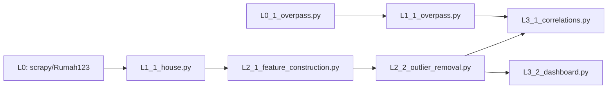
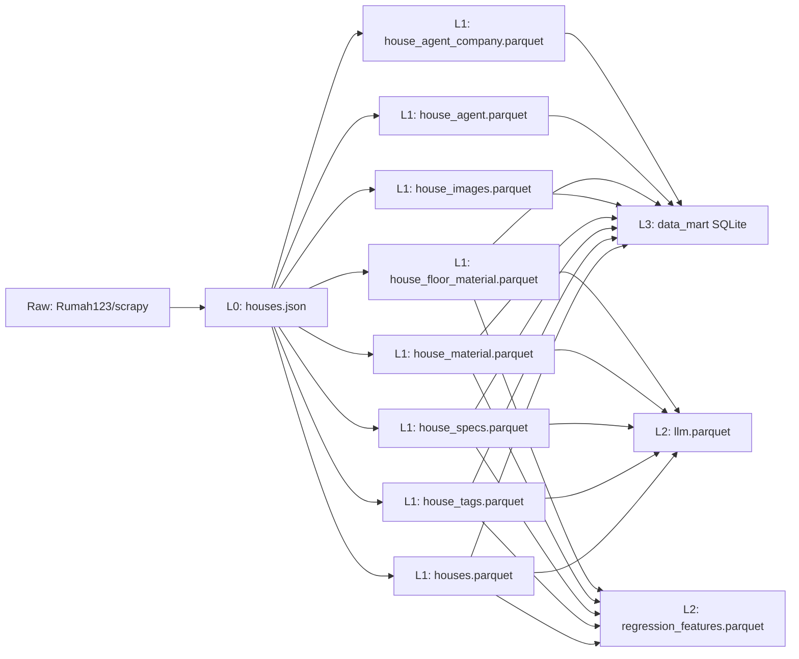

# ETL Pipelines

## ETL DAG

- Kota Bogor: https://nominatim.openstreetmap.org/ui/details.html?osmtype=R&osmid=14745927&class=boundary
- Kabupaten Bogor: https://nominatim.openstreetmap.org/ui/details.html?osmtype=R&osmid=14762112&class=boundary

## Data Lineage

